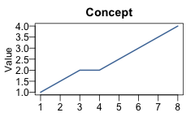
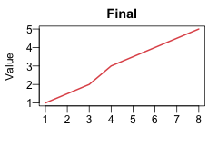

```{r}
#| label: setup
#| include: false
dir.create("img", showWarnings = FALSE)

png("img/concept.png", width = 240, height = 160)
par(mar = c(3, 3, 2, 1), mgp = c(1.8, 0.5, 0))
plot(c(1, 3, 4, 6, 8), c(1, 2, 2, 3, 4), type = "l", lwd = 2,
     col = "#4e79a7", main = "Concept", xlab = "", ylab = "Value", las = 1)
dev.off()

png("img/final.png", width = 240, height = 160)
par(mar = c(3, 3, 2, 1), mgp = c(1.8, 0.5, 0))
plot(c(1, 3, 4, 6, 8), c(1, 2, 3, 4, 5), type = "l", lwd = 2,
     col = "#e15759", main = "Final", xlab = "", ylab = "Value", las = 1)
dev.off()
```

Events can contain any block content — including images and code chunk output such as R plots.

## Inline images

Place a standard Markdown image inside an `.event` div:

::: {.timeline .vertical}
::: {.event data-label="2020"}
**Concept sketch**


:::
::: {.event data-label="2022"}
**Final design**


:::
:::

```markdown
::: {.timeline .vertical}
::: {.event data-label="2020"}
**Concept sketch**


:::
::: {.event data-label="2022"}
**Final design**


:::
:::
```

Images are constrained to the event width via `max-width: 100%`, so they scale down automatically in narrow events such as those in the horizontal layout.

## R plots

Place a code chunk inside an `.event` div. Use `fig-width` and `fig-height` to control the rendered size. In the horizontal layout each event is narrow, so keep plots compact:

```{{r}}
#| fig-width: 2.5
#| fig-height: 3
plot(mpg ~ disp, data = mtcars, pch = 19, cex = 0.7)
```

### Horizontal

::: timeline
::: {.event data-label="Displacement"}
**MPG vs displacement**

```{r}
#| fig-width: 2.5
#| fig-height: 3
plot(mpg ~ disp, data = mtcars, pch = 19, cex = 0.7)
```
:::
::: {.event data-label="Weight"}
**HP vs weight**

```{r}
#| fig-width: 2.5
#| fig-height: 3
plot(hp ~ wt, data = mtcars, pch = 19, cex = 0.7)
```
:::
::: {.event data-label="Distribution"}
**MPG distribution**

```{r}
#| fig-width: 2.5
#| fig-height: 3
hist(mtcars$mpg, breaks = 10, main = "", xlab = "mpg")
```
:::
:::

````markdown
::: timeline
::: {.event data-label="Displacement"}
**MPG vs displacement**

```{{r}}
#| fig-width: 2.5
#| fig-height: 3
plot(mpg ~ disp, data = mtcars, pch = 19, cex = 0.7)
```
:::
...
:::
````

### Vertical

Vertical events span the full content width, so larger plots fit well:

::: {.timeline .vertical}
::: {.event data-label="Step 1"}
**Displacement vs MPG**

```{r}
#| fig-width: 5
#| fig-height: 2.5
plot(mpg ~ disp, data = mtcars, pch = 19, cex = 0.7)
```
:::
::: {.event data-label="Step 2"}
**Weight vs HP**

```{r}
#| fig-width: 5
#| fig-height: 2.5
plot(hp ~ wt, data = mtcars, pch = 19, cex = 0.7)
```
:::
:::

````markdown
::: {.timeline .vertical}
::: {.event data-label="Step 1"}
**Displacement vs MPG**

```{{r}}
#| fig-width: 5
#| fig-height: 2.5
plot(mpg ~ disp, data = mtcars, pch = 19, cex = 0.7)
```
:::
...
:::
````

## RevealJS sizing

In RevealJS presentations, events in the horizontal layout are wider than in HTML documents (a 1280 × 720 slide with three events gives each event ~413 px). Scale up accordingly:

```{{r}}
#| fig-width: 5
#| fig-height: 3
plot(mpg ~ disp, data = mtcars, pch = 19, cex = 0.7)
```

For vertical layouts on a RevealJS slide, events span the full slide width, so even wider plots work well:

```{{r}}
#| fig-width: 8
#| fig-height: 3
plot(mpg ~ disp, data = mtcars, pch = 19, cex = 0.7)
```
